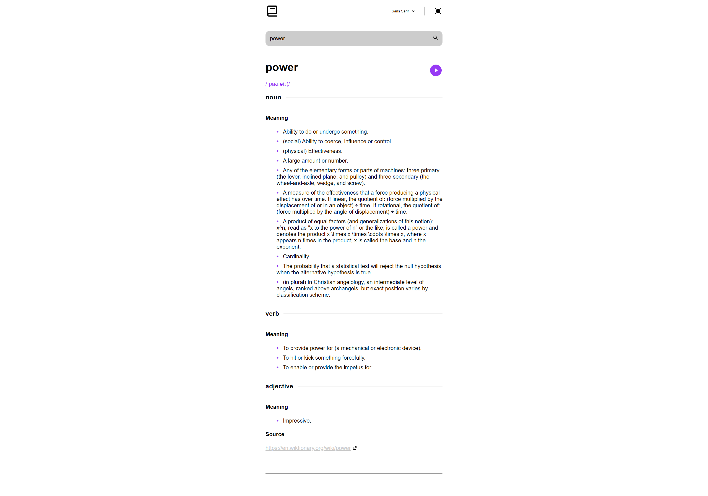
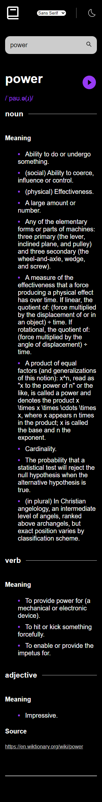

## Dictionary Web App

## About:

- This project is a web application that allows users to easily and quickly access definitions for a wide range of words. The app is built using the React JavaScript library. The app utilizes a free dictionary API to retrieve the definitions for the words that users search for. This API allows the app to access a vast database of words and their meanings, ensuring that the app can provide accurate and reliable definitions for a wide range of words. Overall, this project is a useful and user-friendly tool for anyone looking to quickly and easily access definitions for a variety of words.

## Built with:

- React
- CSS
- Chakra UI (for a loading spinner)
- Free Dictionary API

## Live Site URL:

- https://dlxzeus777.github.io/dictionary-web-app/
